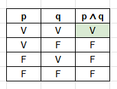
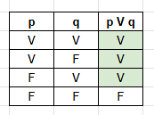
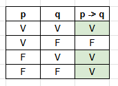
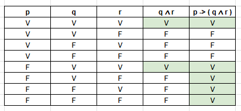
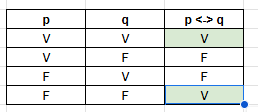
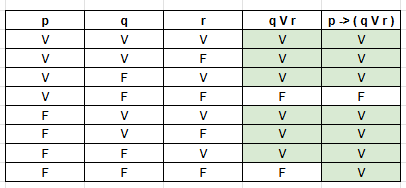

1. Eu estudei para a prova e fiz todos os exercícios.
    
    Conectivo: E ( ∧ )
    
    Proposições:
    
    p: Eu estudei para a prova
    q: Fiz todos os exercícios
    
    Expressão: p ∧ q

    Tabela Verdade:
    
    

    
2. Eu vou ao cinema ou fico em casa assistindo séries.
    
    Conectivo: OU ( V )
    
    Proposições:
        p: Eu vou ao cinema
        q: Fico em casa assistindo séries
    
    Expressão: p V q

    Tabela Verdade:

    

3. Se eu acordar cedo, então conseguirei pegar o ônibus.
    
    Conectivo: SE ENTÃO ( -> )
    
    Proposições:
        p: Acordar cedo
        q: Conseguirei pegar o ônibus
    
    Expressão: p -> q

    Tabela Verdade:

    

4. Se eu estudar muito, então passarei na prova e ganharei um presente.
    
    Conectivo: SE ENTÃO ( -> ) e E ( ∧ )
    
    Proposições:
        p: Estudar muito
        q: Passarei na prova
        r: Ganharei um presente
    
    Expressão: p -> ( q ∧ r )

    Tabela Verdade:

    

5. Eu vou jogar videogame ou vou estudar lógica de programação.
    
    Conectivo: OU ( V )
    
    Proposições:
        p: Eu vou jogar videogame
        q: Vou estudar lógica de programação
    
    Expressão: p V q

    Tabela Verdade:

    

6. Eu comi pizza e tomei refrigerante.
    
    Conectivo: E ( ∧ )
    
    Proposições:
    p: Eu comi pizza
    q: Tomei refrigerante
    
    Expressão: p ∧ q

    Tabela Verdade:
    
    

7. Se eu tiver dinheiro, então viajarei nas férias.
    
    Conectivo: SE ENTÃO ( -> )
    
    Proposições:
        p: Acordar cedo
        q: Conseguirei pegar o ônibus
    
    Expressão: p -> q

    Tabela Verdade:

    

8. Eu lerei um livro se e somente se terminar meu trabalho.

    Conectivo: SE ENTÃO ( <-> )
    
    Proposições:
        p: Eu lerei um livro
        q: Eu terminar meu trabalho
    
    Expressão: p <-> q

    Tabela Verdade:

    

9. Se estiver sol, então irei à praia ou ao parque.
    
    Conectivo: SE ENTÃO ( -> ) e OU ( V )
    
    Proposições:
        p: Se estiver sol
        q: Irei à praia
        r: Irei ao parque
    
    Expressão: p -> ( q V r )

    Tabela Verdade:

    

10. Eu farei um bolo se e somente se comprar os ingredientes.
    
    Conectivo: SE ENTÃO ( <-> )
    
    Proposições:
        p: Eu farei um bolo
        q: Eu comprar os ingredientes
    
    Expressão: p <-> q

    Tabela Verdade:

    