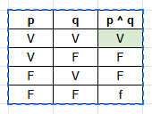

1. Eu estudei para a prova e fiz todos os exercícios.
    Conectivo: E (^)
    Proposições:
        p: Eu estudei para a prova
        q: Fiz todos os exercícios
    Expressão: p ^ q

    Tabela Verdade:
        